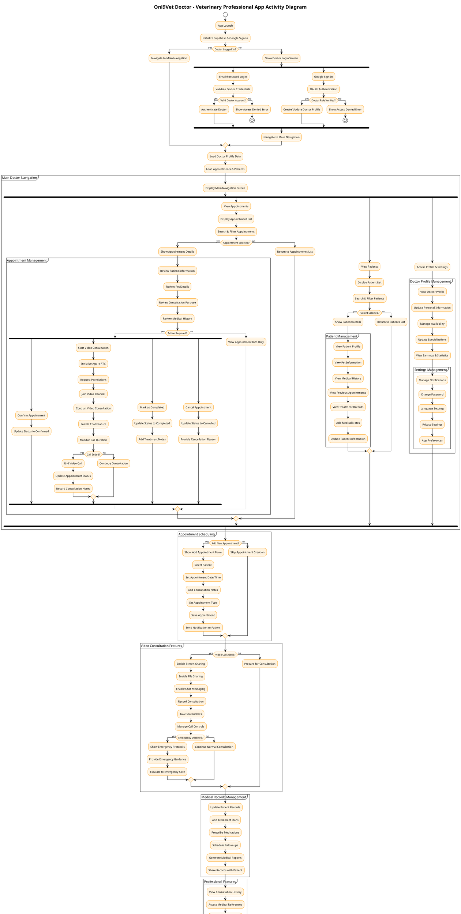

# Onl9Vet Doctor App Activity Diagram

## Overview
This activity diagram represents the main doctor workflows and system interactions in the Onl9Vet Doctor telemedicine application, designed specifically for veterinary professionals.

## PlantUML Code

## Key Doctor Workflows

### 1. Authentication & Authorization
- **Doctor-Specific Login**: Role-based authentication for veterinary professionals
- **Access Control**: Verification of doctor credentials and permissions
- **Profile Management**: Doctor-specific profile and settings

### 2. Appointment Management
- **Appointment Dashboard**: Overview of all scheduled consultations
- **Appointment Details**: Comprehensive view of patient and pet information
- **Status Management**: Confirm, start, complete, or cancel appointments
- **Search & Filter**: Advanced filtering by status, date, patient, etc.

### 3. Patient Management
- **Patient Database**: Complete patient and pet records
- **Medical History**: Access to previous consultations and treatments
- **Patient Profiles**: Detailed information about pets and owners
- **Record Updates**: Add notes, treatments, and follow-up plans

### 4. Video Consultation System
- **Agora RTC Integration**: Professional-grade video calling
- **Consultation Tools**: Screen sharing, file sharing, chat messaging
- **Call Management**: Start, monitor, and end consultations
- **Emergency Protocols**: Handle emergency situations appropriately

### 5. Medical Records & Documentation
- **Treatment Plans**: Create and manage treatment protocols
- **Prescriptions**: Generate medication prescriptions
- **Medical Notes**: Document consultation findings and recommendations
- **Follow-up Scheduling**: Plan and schedule follow-up appointments

### 6. Professional Features
- **Performance Analytics**: View consultation statistics and earnings
- **Work Schedule**: Manage availability and working hours
- **Medical References**: Access veterinary resources and guidelines
- **Professional Development**: Track continuing education and certifications

## Technical Components

### Backend Services
- **Supabase**: Authentication, database, and real-time data
- **Agora**: Professional video calling infrastructure
- **Firebase**: Additional data storage and analytics
- **Google Sign-In**: OAuth authentication for doctors

### Key Features
- **Role-Based Access**: Doctor-specific authentication and permissions
- **Real-time Video Consultation**: Professional Agora RTC integration
- **Patient Records Management**: Comprehensive medical record system
- **Appointment Scheduling**: Advanced scheduling and management tools
- **Professional Dashboard**: Analytics and performance tracking

## Data Flow
1. **Doctor Authentication** → **Role Verification** → **Access Grant**
2. **Appointment Review** → **Patient Assessment** → **Treatment Planning**
3. **Video Consultation** → **Real-time Communication** → **Medical Documentation**
4. **Patient Records** → **Data Updates** → **Information Synchronization**
5. **Professional Analytics** → **Performance Tracking** → **Report Generation**

## Security & Compliance
- **HIPAA Compliance**: Secure handling of medical information
- **Role-Based Security**: Doctor-specific access controls
- **Data Encryption**: Secure transmission and storage of patient data
- **Audit Trails**: Complete logging of all medical activities

This activity diagram provides a comprehensive view of the Onl9Vet Doctor app's functionality, showing how veterinary professionals interact with the system to provide telemedicine services, manage patients, and maintain professional standards in veterinary care. 